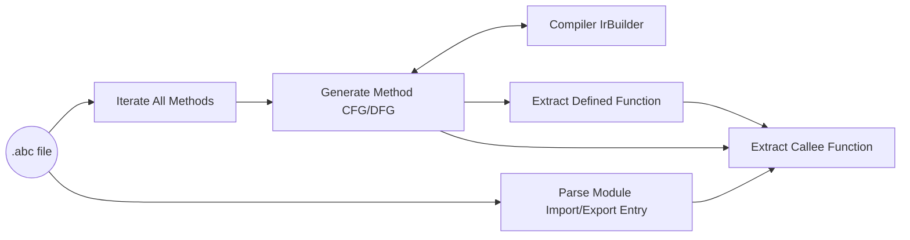

# 基于abc字节码文件的分析接口 #

## 1.背景 ##

JS/TS应用中对关键敏感函数的调用参数，如果直接来自用户的外部输入，没有进行有效性判断，容易导致注入攻击或者应用程序崩溃。因此，需要提供基于abc字节码文件的安全漏洞扫描工具，以提高应用的可靠性、安全性。

在此，我们为安全漏洞扫描工具提供基于abc字节码文件的分析接口，以供其分析相关函数的调用链和参数信息，进行漏洞检测。

## 2.原理 ##

接口实现流程如下：



对一个abc文件，我们会解析它Import/Export 的Module，同时迭代所有函数（包括class和method），生成所有函数的CFG/DFG。其中，在生成CFG/DFG的过程，会调用IR Builder中的相关接口。然后，根据生成的CFG/DFG和以及Import/Export的信息，构建函数之间的定义关系和调用关系以及类的继承关系。

## 3.使用方法 ##

### 3.1 下载OpenHarmony代码 ###
下载教程：https://gitee.com/openharmony/docs/blob/master/zh-cn/device-dev/get-code/sourcecode-acquire.md

### 3.2 执行预下载命令 ###
```
./build/prebuilts_download.sh
```

### 3.3 创建并编译示例文件 ###

#### 3.3.1 新建文件 ####

进入`libark_defect_scan_aux/tests/unittest`目录，新建文件`defect_scan_aux_demo.cpp`（示例）。

代码中指定abc文件（例如，`modules.abc`）及调用api，示例内容如下：

```
#include "defect_scan_aux_api.h"

int main()
{
	std::cout << "===== [libark_defect_scan_aux] Running start =====" << std::endl;
	{
		std::string_view abc_filename = "modules.abc";
		auto abc_file = panda::defect_scan_aux::AbcFile::Open(abc_filename);
		if (abc_file == nullptr) {
			std::cout << "  --- abc file obj is null ---" << std::endl;
		}
		size_t def_func_cnt = abc_file->GetDefinedFunctionCount();
		std::cout << "  --- function count: " << def_func_cnt << " ---" << std::endl;
		size_t def_class_cnt = abc_file->GetDefinedClassCount();
		std::cout << "  --- class count: " << def_class_cnt << " ---" << std::endl;
	}
	std::cout << "===== [libark_defect_scan_aux] end =====" << std::endl;

	return 0;
}
```

#### 3.3.2 添加构建动作 ####
修改文件：`https://gitee.com/openharmony/arkcompiler_runtime_core/blob/master/libark_defect_scan_aux/tests/unittest/BUILD.gn`

在该文件末尾 **添加** 下面代码：

```
ohos_executable("defect_scan_aux_demo") {
    sources = [ "defect_scan_aux_demo.cpp" ]

    configs = [ "$ark_root/libark_defect_scan_aux:defectscanaux_test_config" ]

    deps = [
        "$ark_root/libark_defect_scan_aux:libark_defect_scan_aux_static_test",
        sdk_libc_secshared_dep,
    ]
    deps += [ ":generate_abc_file" ]

    part_name = "runtime_core"
    subsystem_name = "arkcompiler"
}
```

#### 3.3.3 添加构建依赖 ####
修改文件：`OHOS_ROOT/openharmony/arkcompiler/runtime_core/BUILD.gn`

搜索group("ark_host_linux_defectscanaux_unittest")，在deps中`添加一行`：

```
group("ark_host_linux_defectscanaux_unittest") {
    testonly = true
    deps = []
    if (host_os == "linux") {
        deps += [ 
            "$ark_root/libark_defect_scan_aux/tests/unittest:defect_scan_aux_unittest(${host_toolchain})", 
            "$ark_root/libark_defect_scan_aux/tests/unittest:defect_scan_aux_demo(${host_toolchain})", //新增这一行
        ]
    }
}
```

#### 3.3.4 执行构建 ####
```
cd OHOS_ROOT/
```
```
./build.sh --product-name rk3568 --build-target ark_host_linux_defectscanaux_lib --build-target ark_host_linux_defectscanaux_unittest --no-prebuilt-sdk
```

#### 3.3.5 DevEco编译生成abc文件 ####
使用DevEco，编译应用。编译成功后，解压hap包，取里面的abc文件(modules.abc)。
将该文件上传至：`OHOS_ROOT/out/rk3568/clang_x64/arkcompiler/runtime_core`目录下。

#### 3.3.6 执行扫描 ####
```
cd OHOS_ROOT/out/rk3568/clang_x64/arkcompiler/runtime_core
```
```
./defect_scan_aux_demo
```
即可运行3.3.1中的demo示例。

## 4.接口说明 ##

### 4.1 ###
文件：runtime_core/libark_defect_scan_aux/abc_file.cpp

类：AbcFile

| 接口名及参数                                                                           | 描述                                         |
|---------------------------------------------------------------------------------------|---------------------------------------------|
| static std::unique_ptr<const AbcFile> Open(std::string_view abc_filename)             | 根据文件名打开abc文件，返回指向该文件的指针     |
| const std::string &GetAbcFileName() const                                             | 返回abc文件名                                |
| size_t GetDefinedFunctionCount() const                                                | 返回定义的function的个数                      |
| size_t GetDefinedClassCount() const                                                   | 返回定义的类的个数                            |
| const Function *GetDefinedFunctionByIndex(size_t index) const                         | 根据function列表中的index下标返回指定function  |
| const Function *GetFunctionByName(std::string_view func_name) const                   | 根据function名返回指定function                |
| const Function *GetExportFunctionByExportName(std::string_view export_func_name) cons | 根据export别名返回指定function                |
| const Class *GetDefinedClassByIndex(size_t index) const                               | 根据class列表中的index下标返回指定类           |
| const Class *GetClassByName(std::string_view class_name) const                        | 根据类名返回指定类                             |
| const Class *GetExportClassByExportName(std::string_view export_class_name) const     | 根据export别名返回指定类                       |
| ssize_t GetLineNumberByInst(const Function *func, const Inst &inst) const             | 根据指令返回该指令对应源码的行号                |
| const std::vector<std::unique_ptr<Class>> GetClassList() const                        | 返回包含所有类的列表                           |

### 4.2 ###
文件：runtime_core/libark_defect_scan_aux/function.cpp

类：Function

| 接口名及参数                                                            | 描述                         |
|------------------------------------------------------------------------|------------------------------|
| const std::string &GetFunctionName() const                             | 返回function名               |
| const AbcFile *GetAbcFileInstance() const                              | 返回指向abc文件的指针         |
| const Graph &GetGraph() const                                          | 返回graph(定义在ir中)         |
| const Class *GetClass() const                                          | 返回指向类的指针              |
| const Function *GetParentFunction() const                              | 返回该function的父function    |
| uint32_t GetArgCount() const                                           | 返回参数个数                  |
| size_t GetDefinedClassCount() const                                    | 返回定义的类的个数            |
| size_t GetDefinedFunctionCount() const                                 | 返回定义的function的个数      |
| size_t GetCalleeInfoCount() const                                      | 返回调用信息的个数            |
| const Class *GetDefinedClassByIndex(size_t index) const                | 根据index返回指定类           |
| const Function *GetDefinedFunctionByIndex(size_t index) const          | 根据index返回指定function     |
| const CalleeInfo *GetCalleeInfoByIndex(size_t index) const             | 根据index返回指定的调用信息    |
| std::vector<Inst> GetReturnInstList() const                            | 返回所有return指令的列表      |
| const CalleeInfo *GetCalleeInfoByCallInst(const Inst &call_inst) const | 根据调用指令返回调用信息       |

### 4.3 ###
文件：runtime_core/libark_defect_scan_aux/callee_info.cpp

类：CalleeInfo

| 接口名及参数                                      | 描述                          |
|--------------------------------------------------|-------------------------------|
| bool IsCalleeDefinite() const                    | 判断是否被调用                 |
| int GetCalleeArgCount() const                    | 返回参数个数                   |
| const Inst &GetCallInst() const                  | 返回call指令                  |
| const Function *GetCaller() const                | 返回指向调用的function的指针   |
| const Class *GetClass() const                    | 返回指向类的指针               |
| const Function *GetCallee() const                | 返回指向被调用的function的指针  |
| const std::string &GetFunctionName() const       | 返回function名                |
| const std::string &GetClassName() const          | 返回类名                      |
| const std::string &GetExternalModuleName() const | 返回import的module名          |
| const std::string &GetGlobalVarName() const      | 返回全局变量名                 |

### 4.4 ###
文件：runtime_core/libark_defect_scan_aux/class.cpp

类：Class
| 接口名及参数                                                               | 描述                                   |
|---------------------------------------------------------------------------|---------------------------------------|
| const std::string &GetClassName() const                                   | 返回类名                               |
| const AbcFile *GetAbcFileInstance() const                                 | 返回指向abc文件的指针                   |
| const Function *GetDefineFunction() const                                 | 返回指向类的定义所在的function的指针     |
| size_t GetMemberFunctionCount() const                                     | 返回成员function数量                   |
| const Function *GetMemberFunctionByName(std::string_view func_name) const | 通过名称返回function                   |
| const Function *GetMemberFunctionByIndex(size_t index) const              | 通过成员函数列表的index下标返回function |
| const Class *GetParentClass() const                                       | 返回指向父类的指针                      |
| const std::string &GetParentClassName() const                             | 返回父类名                             |
| const std::string &GetParClassExternalModuleName() const                  | 返回父类import的module名               |
| const std::string &GetParClassGlobalVarName() const                       | 返回父类的全局变量名                    |
| const std::vector<const Function *> GetMemberFunctionList() const         | 返回包含成员function的列表              |
