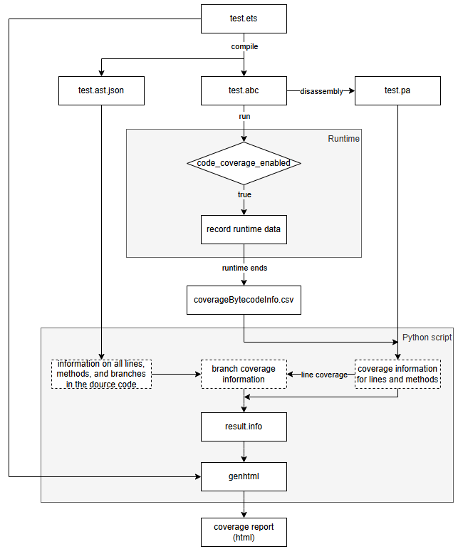

# Design documentation for ArkTS Runtime Coverage Tools

## 1. Introduction
The ArkTS runtime code coverage tools is designed for ArkTS 1.2.

## 2. Design Objectives

The ArkTS Runtime Coverage Tools is implemented to collect line coverage, branch coverage, and method coverage statistics for `*.ets` files during runtime, generating corresponding coverage reports.

## 3. Working Principle

The collection mechanism for ArkTS runtime coverage (including line, method, and branch coverage) operates as follows: The compiler first compiles ETS source code into both Abstract Syntax Tree (AST) files and bytecode (ABC) files. The corresponding PA files are then generated through disassembly of the bytecode. Within a runtime environment with code coverage enabled, the system dynamically collects bytecode execution data and outputs it as CSV-formatted coverage records. Finally, a Python script integrates the ETS source code, AST structure files, disassembled PA files, and CSV execution data to generate a visualized HTML coverage report, enabling systematic analysis of code execution coverage.


## 4. Process Design

Taking the test.ets file as an example, the runtime coverage workflow is illustrated below:



### 4.1. Compilation

- Adding the parameter `--dump-ast` during compilation generates `*.ast.json` files containing the source code's Abstract Syntax Tree (AST) information. The standardized structured data facilitates subsequent parsing and analysis by tools.

Example of the output JSON file:
```json
// ./test.ast.json:
{
  "type": "Program",
  "statements": [
    {
      "type": "ClassDeclaration",
      "definition": {
        "id": {
          "type": "Identifier",
          "name": "ETSGLOBAL",
          "decorators": [],
          "loc": {
            "start": {
              "line": 1,
              "column": 1,
              "program": "test.ets"
            },
            "end": {
              "line": 1,
              "column": 1,
              "program": "test.ets"
            }
          }
        },
        "superClass": null,
        "implements": [],
        "body": [
  ...
}
```
Example of ETS Source Code:
```ts
function func_for(score: number, level:number)
{
    try {
        if (score >= 60 || level == 1 || score >= 90) {
            console.println("Passing grade")
        } else {
            console.println("Failing grade")
        }
        console.println("func_for")
        for (let i: number = 0; i < 10; i++) {
            console.log("Index: " + i);
        }
    } catch (error) {
        console.println("Exception captured: " + error);
    }
}

function main()
{
    func_for(90, 1);
}
```
- Adding the parameter `--opt-level` during compilation produces ABC files, which are binary executable files.
- Adding the parameter `--verbose` during compilation generates PA files.

### 4.2. Runtime

Executing the ABC file generates the coverageBytecodeInfo.csv file, which stores execution information for bytecode lines and functions.

### 4.2.1. Implementation Details

During program execution, the InstrumentInstruction() stub within the interpreter records each executed bytecode instruction. A data structure is used to capture essential information including method_Id, bcOffset, and count. This data is dumped to a file either when specific thresholds are reached during execution or upon program termination.
- Runtime Schematic


- Runtime Flowchart


### 4.2.2. Data Storage Structure

A map is defined, utilizing std::pair<method_Id, bcOffset> as the key and the execution count as the corresponding value. The data storage structure is defined as follows:
```c++
std::unordered_map<std::pair<panda_file::File::EntityId, uint32_t>, uint32_t> bytecodeCountMap_;
```

The fields and their meanings are shown in the following table:

| Field Name    | Description       | Data Type               |
| --------- | -------------- | -------------------------- |
| method_Id | Method Id         | panda_file::File::EntityId |
| bcOffset  | Bytecode Offset   | uint32_t                   |
| count     | Bytecode Execution Count | uint32_t                   |

Example of output data:
```
DA:210139,5,1
DA:210139,3,1
DA:210139,40,1
DA:210159,50,1
DA:210159,35,1
DA:210159,33,1
DA:210159,30,1
DA:210159,28,1
DA:210139,0,1
DA:210159,26,1
DA:210159,24,1
DA:210139,12,1
DA:210159,22,1
DA:210159,20,1
DA:210159,18,1
DA:210139,10,1
DA:210159,16,1
DA:716451,6,6
DA:716088,24,6
DA:716088,19,6
```

### 4.2.3. New Parameters

New options parameter:
```yaml
# runtime_core/static_core/runtime/options.yaml

- name: code-coverage-enabled
  type: bool
  default: false
  description: whether ArkTS 1.2 code coverage is enabled.

- name: code-coverage-output
  type: std::string
  default: ""
  description: Specify the location the collected code coverage information.
```
New system parameter:
```para
persist.ark.static.codecoverage.enable
```
Note: During runtime, code coverage events are categorized into two environments: host and OHOS device:

- Host: In `Runtime::Create()`, the code coverage listening event is initiated solely by retrieving the option switch `--code-coverage-enabled=true`.

- OHOS device: In `PandaEtsVM::PostZygoteFork()`, the code coverage listening event is initiated by retrieving either the environment variable `persist.ark.static.codecoverage.enable` or the option switch.

### 4.3. Data Aggregation

Integrate AST, CSV, and PA files to obtain `result.info`, which provides the necessary conditions for generating subsequent coverage reports.

#### 4.3.1. Acquisition of Line and Method Coverage Information

1. Read the runtime dump file `coverageBytecodeInfo.csv` and consolidate entries with identical `<methodId,bcoffset>` into single records for storage.
2. For each methodId, retrieve the first `<methodId, bcoffset, counter>` data entry. Use the methodId to search in the PA file and obtain the corresponding source file name and function name,thereby generating `FNDA:function_call_count,function_name`.
3. Process each `<methodId, bcoffset, counter>` entry sequentially. Use the `bcoffset` to search in the PA file and obtain the corresponding source code line number (note: the `bcoffset` corresponds to a range mapping to a specific line number. For example, if the retrieved `bcoffset` is 3, it may correspond to line 39), thereby generating `DA:line_number,execution_count`.
4. After processing, the total number of executed functions can be obtained, resulting in `FNH:executed_function_count`.


#### 4.3.2. Acquisition of Branch Coverage Information

1. By reading the compiled dump file *.ast.json, the total number of branches for each file can be obtained from the `total_branches` field. Summing the branch counts across all files yields the `BRF:total_branch_count`.
2. The *.ast.json file contains line range information and valid line details for each branch. By combining this with the previously acquired line coverage information, branch coverage data can be derived based on the coverage status of the first valid line within the branch range. This generates `BRDA:line_number,block_number,branch_index (starting from 0),execution_count`. Accumulating these results produces `BRH:covered_branch_count`.
3. The *.ast.json file also records function definitions and their corresponding line numbers, enabling the generation of `FN:line_number:function_name` and `FNF:total_function_count`.


Branch Types:

| Node Type | Enum Value | Corresponding C++ Class Name | Description |
|---------|-------|------------|------|
| If Statement | IF_STATEMENT | IfStatement | Represents standard if conditional statements, supporting if-else and if-else if-else structures. |
| Switch Statement | SWITCH_STATEMENT | SwitchStatement | Represents multi-branch selection switch statements. |
| Case Branch | SWITCH_CASE_STATEMENT | SwitchCaseStatement | Represents case branches within switch statements. |
| Standard for Loop | FOR_UPDATE_STATEMENT | ForUpdateStatement | Represents standard for loops with initialization, condition, and update expressions (for(init; cond; update) { ... }). |
| for...in Loop | FOR_IN_STATEMENT | ForInStatement | Represents for...in loops that iterate over object properties. |
| for...of Loop | FOR_OF_STATEMENT | ForOfStatement | Represents for...of loops that iterate over elements of iterable objects. |
| while Loop | WHILE_STATEMENT | WhileStatement | Represents while loops that check conditions before execution. |
| do...while Loop | DO_WHILE_STATEMENT | DoWhileStatement | Represents do...while loops that execute first and then check conditions. |
| try...catch Statement | TRY_STATEMENT | TryStatement | Represents try...catch blocks for exception handling. |

#### 4.3.3. Supplementing Uncovered Line Information

1. For unexecuted valid lines, it is necessary to supplement the `result.info` file with entries in the format `DA:18,0`.
2. Using the valid line information from the disassembled PA file as the complete set, and combining it with the previously obtained line coverage data, generates entries in the format `DA:line_number,0` for uncovered lines.

#### 4.3.4. Summary Output

Consolidate all previously obtained information and output it to the `result.info` file.
The following table describes the fields in the INFO file:

| Field Name                          | Description               |
|-----------------------------------|---------------------|
| TN                   | Test suite name.            |
| SF         | Source file path.            |
| FNF                                | Total number of functions.            |
| FNH                                | Number of covered functions.        |
| FNDA                            | Function execution count. Example: `FNDA:5,verifyUser` indicates the verifyUser function was called 5 times. |
| FN                        | Line number where a function is defined. Example: `FN:62,main` indicates the main function is defined at line 62.      |
| DA                                 | Line execution count. Example: `DA:15,5` indicates line 15 was executed 5 times.       |
| BRDA                                | Branch coverage data. Example: `BRDA:25,0,0,2` indicates branch 0 (true) at line 25 was executed 2 times; `BRDA:25,0,1,1` indicates branch 1 (false) at line 25 was executed 1 time.              |
| BRF                                 | Total number of branches. Example: `BRF:4` indicates 4 total branches.          |
| BRH                                 | Number of covered branches. Example: `BRH:3` indicates 3 branches were covered.      |
| end_of_record                                 | End of record marker.            |

Example of `result.info` File Format:
```
TN:TestLoginModule
SF:/project/src/auth/login.c
FN:15,verifyUser
FN:38,checkPassword
FN:62,main
FNDA:5,verifyUser
FNDA:3,checkPassword
FNDA:1,main
FNF:3
FNH:3
DA:15,5
DA:16,5
DA:18,0
DA:20,5
DA:38,3
DA:40,3
DA:42,2
DA:45,1
DA:62,1
DA:64,1
DA:66,0
BRDA:25,0,0,2
BRDA:25,0,1,1
BRDA:48,1,0,3
BRDA:48,1,1,0
BRF:4
BRH:3
end_of_record
```

Input Data Directory Structure:

```shell
# /runtime_core/static_core/runtime/tooling/coverage
.
├── README.txt
├── ast
│   └── test.json
├── coverage.py
├── result.info
├── pa
│   └── test.pa
├── runtime_info
│   └── coverageBytecodeInfo.csv
└── src
    └── test.ets
```
Prior to execution, the source code must be placed in the `src` directory. The JSON files dumped during compilation should be stored in the `ast` directory, while the disassembled PA files should be located in the `pa` directory. All directory structures must maintain consistency with the src directory. Executing the `coverage.py` script will generate the `result.info` file, which subsequently serves as input for producing the coverage report.

### 4.4. Coverage Report

Merge and process the source code execution information recorded by both the interpreter and frontend to generate code coverage metrics. Based on both the baseline coverage and the coverage after applying incremental diffs, analyze and generate incremental coverage reports.

#### 4.4.1. Implementation Principle

Leverage the third-party tool `genhtml` to convert the collected raw coverage data `XXX.info` into HTML files.

- Collect current coverage data:
Execute `genhtml test.info -o ./output -s --branch-coverage`. HTML files will be generated in the `output` directory.

- Collect incremental coverage data:
Execute `genhtml -b baseline.info coverage.info -o ./output -s --branch-coverage`. HTML files will be generated in the `output` directory.

#### 4.4.2. Report Format

- Overall Coverage Data Format:


- Individual File Coverage Format:


- Incremental Coverage Format:

